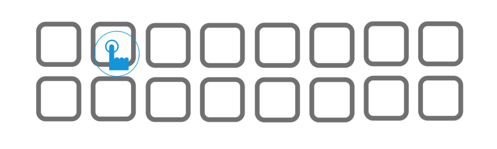

    

    
    

    

    

- This is a iOS UICollectionView UICollectionViewCell drag again arrangement framework Objective-C Version.
- [Swift Version](https://github.com/liangdahong/BMDragCellCollectionView-Swift).

## License 📄

- [已加入 996 战队](https://github.com/996icu/996.ICU)

- [996 license](LICENSE).
