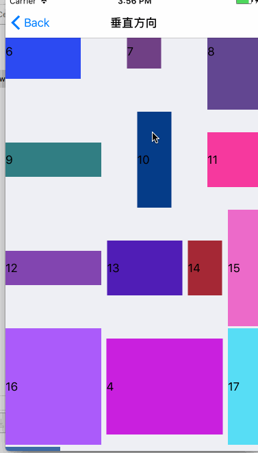
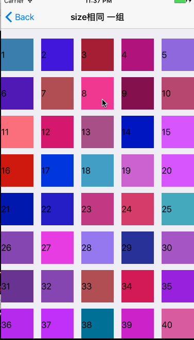
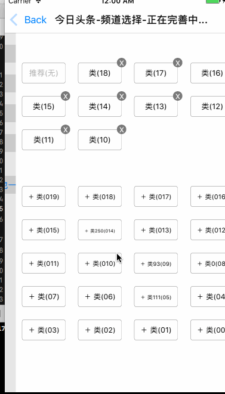

<p align="center">

</p>

[](https://github.com/asiosldh/BMDragCellCollectionView "BMDragCellCollectionView name")

[](http://cocoapods.org/pods/BMDragCellCollectionView) 
  
 
[](https://www.apple.com/nl/ios/) 
[](http://weibo.com/liangdahong) 
[](https://github.com/asiosldh/BMDragCellCollectionView/stargazers)

## 写在前面
> 最近公司准备做一个类似支付宝`UICollectionViewCell`拖拽重排的功能，`UICollectionViewCell`的任意拖拽排列，支付宝最新的版本已去掉了任意拖拽功能，而只是对常用功能进行拖拽重排，没有出现超出屏幕的情况。个人感觉应该更好，毕竟太多功能去拖拽重排对用户来说是一个特别大的工作量，只需把常用功能提即可。相应的功能点还是在对应的分组里，至于我们的需求暂时不怎么清楚，使用还是研究下任意拖拽吧。

## 未来计划
* [ ] Demo及文档完善。
* [ ] `支付宝`拖拽效果实现。
* [x] `今日头条`频道拖拽重排效果实现。
* [ ] `看荐`拖拽重排效果实现及优化。ps:`看荐`的拖拽重排发现一个bug，哈哈。

## 效果图 

### 效果1
<p align="center">

</p>

### 效果2

<p align="center">

</p>

### 效果3

<p align="center">

</p>

>基本实现了`头条`的频道重排功能，额外增加了当拖拽到边沿时自动滚动的功能。

### 视频演示
[在线视频演示](http://v.youku.com/v_show/id_XMjkxNTM2MjIyNA==.html?spm=a2hzp.8244740.0.0)

## 须知
>`BMDragCellCollectionView ` 基于 `Xcode 8.2.1 , iOS 6+ ARC `，请使用最新正式版来编译`BMDragCellCollectionView `,旧版本的`Xcode `有效，但不保证会出现一些兼容性问题。

>开源不易，来个[star](https://github.com/asiosldh/BMDragCellCollectionView)鼓励下吧

## Demo运行 
> 老提不要说不会 `Cocoapods`

1. `cd BMDragCellCollectionView/BMDragCellCollectionViewDemo` 

2. `open BMDragCellCollectionViewDemo.xcodeproj`


## 集成
### CocoaPods
> 推荐使用 CocoaPods 安装。

1. 在 `Podfile ` 中添加 `pod 'BMDragCellCollectionView', '1.0.5'` [](http://cocoapods.org/pods/BMDragCellCollectionView) 
2. 执行 `pod install` 或 `pod update`
3. 使用的地方导入 `"BMDragCellCollectionView.h"`
4. 如果无法找到 `BMDragCellCollectionView `可用 `pod setup`或 `rm ~/Library/Caches/CocoaPods/search_index.json` 在 `pod search BMDragCellCollectionView`
5. 
### 手动安装

1. 通过 `Clone ` 或者 `download ` 下载`BMDragCellCollectionView ` 文件夹内的所有内容。
2. 将 BMDragCellCollectionView 内的源文件添加(拖放)到你的工程。
3. 导入 `"BMDragCellCollectionView.h"`

## 基本使用
- 在需要使用长按拖拽`UICollectionView `的地方使用`BMDragCellCollectionView`代替，用法和`UICollectionView`一样。

```c
UICollectionViewFlowLayout *layout = [[UICollectionViewFlowLayout alloc] init];
BMDragCellCollectionView *collectionView = [[BMDragCellCollectionView alloc] initWithFrame:CGRectMake(0, 0, WIDTH, HEIGHT) collectionViewLayout:layout];
collectionView.delegate = self;
collectionView.dataSource = self;
[self.view addSubview:collectionView];
```

- 实现 `BMDragCollectionViewDataSource`协议的如下方法

> 此协议用于在交换时获取数据源，内部做数据源操作。

```c
- (NSArray *)dataSourceWithDragCellCollectionView:(BMDragCellCollectionView *)dragCellCollectionView {
    return self.dataSource;
}
```

- 实现 `BMDragCellCollectionViewDelegate`协议的如下方法

> 此协议用于在在内部处理好数据源时通知使用者更新数据源。

```c
- (void)dragCellCollectionView:(BMDragCellCollectionView *)dragCellCollectionView newDataArrayAfterMove:(NSArray *)newDataArray {
    self.dataSource = [newDataArray mutableCopy];
}
```
## BMDragCellCollectionView属性及方法说明
>  长按触发时间，默认是0.5秒，建议根据实际情况设值

```c
@property (nonatomic, assign) NSTimeInterval minimumPressDuration;
```

>  是否可以拖拽 默认为YES

```c
@property (nonatomic, assign, getter=isCanDrag) BOOL canDrag;
```

>  长按拖拽时Cell缩放比例 默认是：1.2

```c
@property (nonatomic, assign) CGFloat dragZoomScale;
```

>   拖拽的Cell在拖拽移动时的透明度 默认是： 1.0

```c
@property (assign, nonatomic) CGFloat dragCellAlpha;
```

>  使用者想移动到指定位置操作时

```c
- (void)dragMoveItemToIndexPath:(NSIndexPath *)indexPath;
```

## 代理方法

> 当一个`Cell`将要开始拖拽时调用询问是否可以拖拽， `YES`: 可以， `NO`: 不可以，默认是`YES`

```c
- (BOOL)dragCellCollectionViewShouldBeginMove:(BMDragCellCollectionView *)dragCellCollectionView indexPath:(NSIndexPath *)indexPath;

```

>  当将要交换时，询问是否可以交换时调用询问是否可以交换， `YES`: 可以， `NO`: 不可以，默认是`YES`

```c
- (BOOL)dragCellCollectionViewShouldBeginExchange:(BMDragCellCollectionView *)dragCellCollectionView sourceIndexPath:(NSIndexPath *)sourceIndexPath toIndexPath:(NSIndexPath *)destinationIndexPath;
```

>   完成重排时，重排成成功时

```c
- (void)dragCellCollectionViewDidEndDrag:(BMDragCellCollectionView *)dragCellCollectionView;
```

>   下面的三个方法在手势拖拽变化时调用，`开始拖拽` `正在拖拽` `结束拖拽`，

```c
- (void)dragCellCollectionView:(BMDragCellCollectionView *)dragCellCollectionView beganDragAtPoint:(CGPoint)point   indexPath:(NSIndexPath *)indexPath;

- (void)dragCellCollectionView:(BMDragCellCollectionView *)dragCellCollectionView changedDragAtPoint:(CGPoint)point indexPath:(NSIndexPath *)indexPath;

- (void)dragCellCollectionView:(BMDragCellCollectionView *)dragCellCollectionView endedDragAtPoint:(CGPoint)point   indexPath:(NSIndexPath *)indexPath;
```

>   结束拖拽时时是否内部自动处理，在一些需要特殊需求时可以在此方法做，如：今日头条当第一组拖拽到第二组（(默认是不交换处理的）松手时需要自动把此Cell移动到第二组中的同步或者尾部。那可在此方法 返回NO,同时调用 `- (void)dragMoveItemToIndexPath:(NSIndexPath *)indexPath;`方法完成移动
> 

```c
- (BOOL)dragCellCollectionView:(BMDragCellCollectionView *)dragCellCollectionView endedDragAutomaticOperationAtPoint:(CGPoint)point section:(NSInteger)section indexPath:(NSIndexPath *)indexPath;
```


- 其他相关用法，详见[代码](https://github.com/asiosldh/BMDragCellCollectionView/blob/master/BMDragCellCollectionView/BMDragCellCollectionView.h)
- [cocoapods在线文档](http://cocoadocs.org/docsets/BMDragCellCollectionView/1.0.0/)

## 期待
- 如果在使用过程中遇到BUG，希望您能[Issues](https://github.com/asiosldh/BMDragCellCollectionView)我。

## 版本历史
### v1.0.6
### v1.0.5
### v1.0.4
### v1.0.3
### v1.0.2
### v1.0.1
### v1.0.0 

## MIT
`BMDragCellCollectionView `使用 MIT 许可证，详情可见 [LICENSE](LICENSE) 文件

