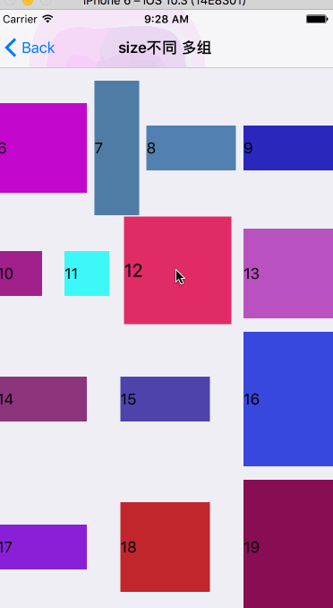

 
 

 
  
 
 

---

## 写在前面

> 同款的[Swift版本](https://github.com/asiosldh/BMDragCellCollectionViewSwift)。

## 声明

> 此库在[https://github.com/wazrx/XWDragCellCollectionView](https://github.com/wazrx/XWDragCellCollectionView)的基础上进行了一系列优化及丰富API。

## 未来计划
* [x] [Swift版本](https://github.com/asiosldh/BMDragCellCollectionViewSwift)。
* [x] Demo及文档完善。
* [x] `支付宝`拖拽效果实现,资源来源于[http://www.iconfont.cn/](http://www.iconfont.cn/)感谢。
* [x] `今日头条`频道拖拽重排效果实现。
* [ ] `腾讯新闻`频道拖拽重排效果实现。
* [ ] `看荐`拖拽重排效果实现及优化。ps:`看荐`的拖拽重排发现一个bug，哈哈。
* [ ] 您认为有必要的也@我哈.

## 效果图 

## 集成

- 支持 `CocoaPods` 
- 手动安装

## 使用
- 请查看 Demo 和 API 说明

## 期待
- [欢迎 Issues](https://github.com/liangdahong/BMDragCellCollectionView/issues)

## MIT

