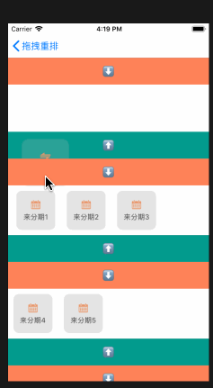
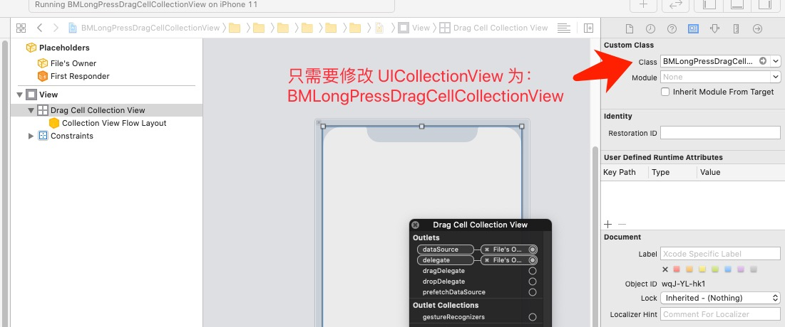
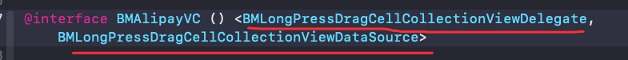
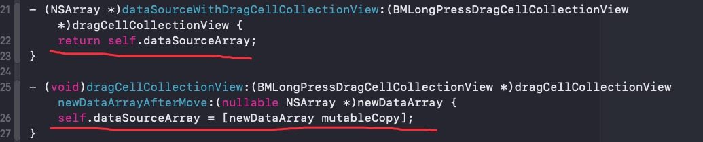
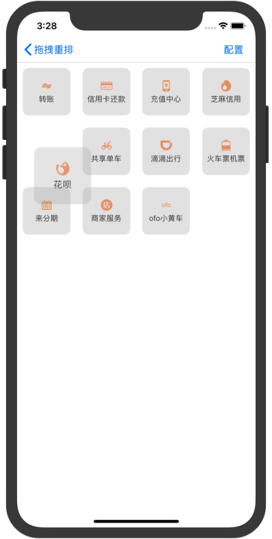
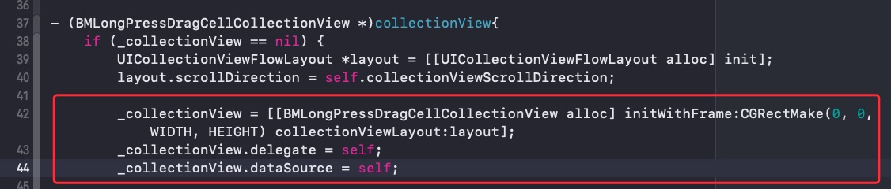
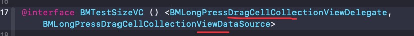
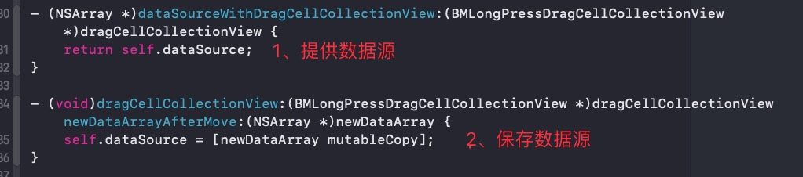
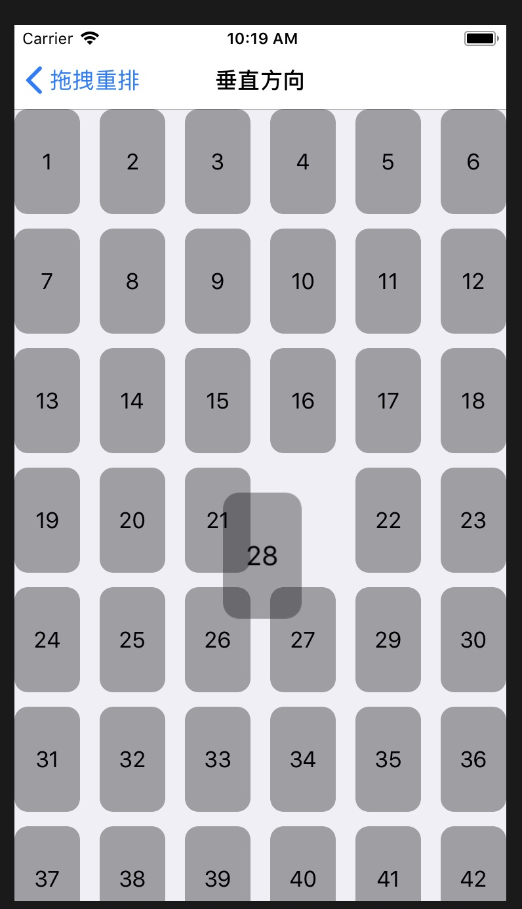

# BMLongPressDragCellCollectionView

## Demonstration

<p align="center">
    
    
    
<p/>

<p align="center">
<a href="#"></a>
<a href="#"></a>
<a href="#"></a>
<a href="#"></a>
<a href="#"></a>
</p>


## Introduction

- 本框架是一个让你轻松实现类似支付宝的拖拽重排功能，支持自定义，支持 iOS7+，具体可查看代码。

##  CocoaPods

```ruby
pod 'BMLongPressDragCellCollectionView'
```

```ruby
pod install
```

```objective-c
#import "BMLongPressDragCellCollectionView.h"
```

## 使用说明

1. `BMLongPressDragCellCollectionView` 是继自 `UICollectionView` ，其使用方式和 `UICollectionView` 一致，只需要把 `UICollectionView` 修改为 `BMLongPressDragCellCollectionView` 即可【支持 Xib，StoryBoard】。
2. 原来的 `UICollectionViewDataSource` 换为 B`MLongPressDragCellCollectionViewDataSource` 
3. 原来的 `UICollectionViewDelegateFlowLayout` 换为 `BMLongPressDragCellCollectionViewDelegate`。
4. 实现数据源方法，内部会使用此方法获取数据源，必须实现。 

```
- (nullable NSArray *)dataSourceWithDragCellCollectionView:(BMLongPressDragCellCollectionView *)dragCellCollectionView;
```
如下：

```
- (NSArray *)dataSourceWithDragCellCollectionView:(BMLongPressDragCellCollectionView *)dragCellCollectionView {
    return self.dataSourceArray;
}
```

5. 实现代理方法，当 Cell 有交换时调用，需要外面保存最新的数据源【如果有交换时，数据源已经更新】，必须实现。

```
- (void)dragCellCollectionView:(BMLongPressDragCellCollectionView *)dragCellCollectionView newDataArrayAfterMove:(nullable NSArray *)newDataArray;
```
如下：

```
- (void)dragCellCollectionView:(BMLongPressDragCellCollectionView *)dragCellCollectionView newDataArrayAfterMove:(nullable NSArray *)newDataArray {
    self.dataSourceArray = [newDataArray mutableCopy];
}
```

## 图文演示

### 在 `Xib`或者 `StoryBoard` 中使用






- 在 `Xib`或者 `StoryBoard` 中只需要上面的 `3 步`就可以让你的 `UICollectionView` 完美支持拖拽重排了。

### 使用纯代码实现






- 在纯代码实现中只需要上面的 `3 步` 就可以让你的 `UICollectionView` 完美支持拖拽重排了。

## 更多自定义方案

如果要做一些自定义的操作可以通过设置 `BMLongPressDragCellCollectionView` 的相关属性或者实现一些特定的协议方法来处理，可查看 `BMLongPressDragCellCollectionView` 的头文件和 `BMLongPressDragCellCollectionViewDelegate` 与 `BMLongPressDragCellCollectionViewDataSource` 协议。

## 联系
- 欢迎 [issues](https://github.com/liangdahong/BMLongPressDragCellCollectionView/issues) 和 [PR](https://github.com/liangdahong/BMLongPressDragCellCollectionView/pulls)
- 也可以加微信 `liangdahong2014` 交流和学习。

## 感谢

- [BMLongPressDragCellCollectionView](https://github.com/liangdahong/BMLongPressDragCellCollectionView) 的核心实现参考了[待补充]()

## 相关推荐

### UITableViewDynamicLayoutCacheHeight
- 🖖高性能的自动计算采用 Autolayout 布局的 UITableViewCell 和 UITableViewHeaderFooterView 的高度，内部自动管理高度缓存。
[https://github.com/liangdahong/UITableViewDynamicLayoutCacheHeight](https://github.com/liangdahong/UITableViewDynamicLayoutCacheHeight)

## License    

BMLongPressDragCellCollectionView is released under the [MIT license](LICENSE). See LICENSE for details.
